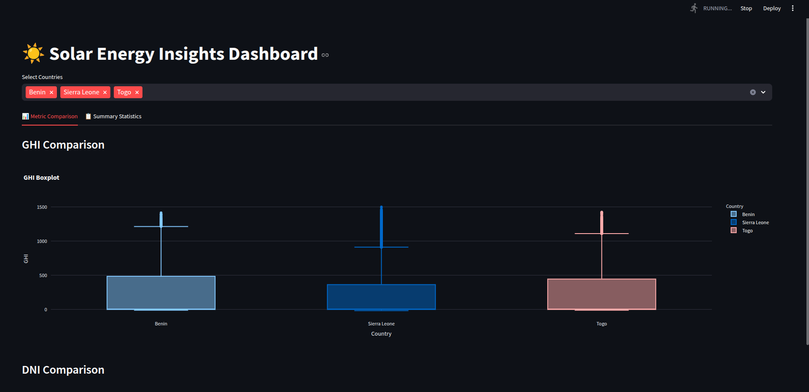
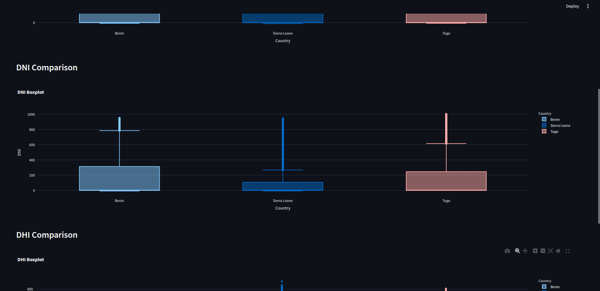
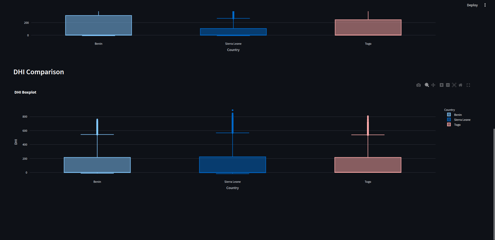

# 🌞 Solar Challenge – Week 0 

Welcome to the **solar-challenge-week0** project! This repository contains data profiling, cleaning, exploratory data analysis (EDA), and a Streamlit dashboard comparing solar metrics (GHI, DNI, DHI) across **Benin**, **Sierra Leone**, and **Togo**.

---

## 🚀 Project Setup Instructions

Follow the steps below to set up and run the dashboard:

### 1. Clone the Repository

```bash
git clone https://github.com/yabe-B/solar-challenge-week1.git
cd solar-challenge-week1
````

---

### 2. Create and Activate a Python Virtual Environment

#### Using `venv` (Recommended)

```bash
python3 -m venv .venv
source .venv/bin/activate      # On Windows: .venv\Scripts\activate
```

#### Using Conda

```bash
conda create --name solar-env python=3.12
conda activate solar-env
```

---

### 3. Install Dependencies

```bash
pip install -r requirements.txt
```

---

### 4. Verify Python Version

```bash
python --version
```

Ensure it shows Python **3.12.x**

---

### 5. Run Tests (Optional)

```bash
pytest
```

---

### 6. Launch the Dashboard

```bash
cd app
streamlit run main.py
```

---

## 📁 Project Structure

```bash
solar-challenge-week1/
├── .github/workflows/             # GitHub Actions for CI/CD
├── app/                           # Streamlit dashboard
│   ├── __init__.py
│   ├── main.py                    # Main Streamlit app
│   └── utils.py                   # Helper functions (load, plot, summarize)
├── data/                          # Cleaned & raw datasets (not tracked)
├── dashboard_screenshots/         # Images of the dashboard
│   └── solar_dashboard_preview.png
├── notebook/                      # Jupyter notebooks (EDA & cleaning)
├── scripts/                       # Utility scripts and helpers
│   ├── __init__.py
│   └── README.md
├── tests/                         # Unit and integration tests
├── requirements.txt               # Project dependencies
├── README.md                      # Project setup and documentation
└── WEEK0_REPORT.md                # Final Week 0 blog-style report
```

---


## 📸 Dashboard Preview




---


## 🧑‍💻 Author

**Yeabsira Behaile**

Prepared as part of the Week 0 challenge at **10 Academy**

